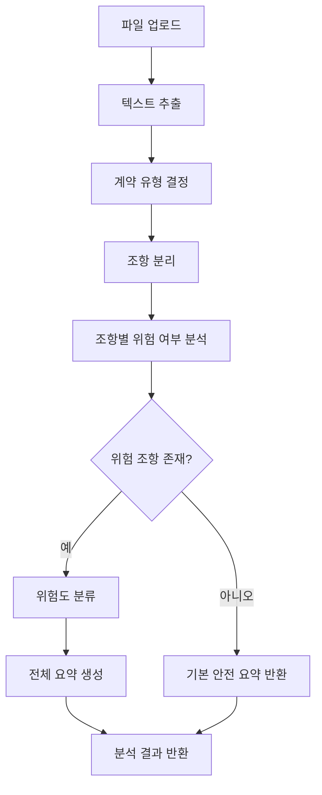

# 계약문서 위험조항 분석 Agent

계약서를 업로드하면 계약 유형을 판별하고, 조항별 위험 여부와 위험도를 분석한 뒤
사용자가 이해하기 쉬운 요약과 상세 설명을 제공하는 서비스입니다.

## 기술 스택

- Frontend: Streamlit, pandas, httpx
- Backend: FastAPI, LangChain, LangGraph
- LLM: Upstage Solar Pro
- 문서 파싱: Upstage Document Parse
- 인프라: Docker Compose

## 실행 방법

### Docker Compose

```bash
cp .env.example .env
# .env 파일의 UPSTAGE_API_KEY를 설정합니다.
docker compose up --build
```

| 서비스 | 주소 |
|--------|------|
| Backend API 문서 | http://localhost:8000/docs |
| Frontend | http://localhost:8501 |

### 개별 실행

Python 3.11 이상을 권장합니다.

```bash
cd backend
pip install -r requirements.txt
uvicorn main:app --reload
```

다른 터미널에서 실행합니다.

```bash
cd frontend
pip install -r requirements.txt
BACKEND_URL=http://localhost:8000 streamlit run app.py
```

API 키가 없더라도 TXT 문서는 규칙 기반 fallback으로 분석할 수 있습니다.
PDF/DOCX 텍스트 추출에는 `UPSTAGE_API_KEY`가 필요합니다.

## 백엔드 분석 파이프라인

`backend/services/orchestrator.py`의 LangGraph `StateGraph`가 전체 분석 흐름을
관리합니다. 각 노드는 하나의 책임만 담당하고 실행 결과를 `process_logs`에
기록합니다.



위험 조항이 없으면 위험도 분류와 LLM 요약을 호출하지 않습니다. 위험 조항이
있을 때만 `classify_risk()`와 `summarize()`를 실행합니다.

## 주요 디렉터리 구조

```text
backend/
  main.py
  services/
    orchestrator.py
    extractor.py
    analyzer.py
    classifier.py
    summarizer.py
    explainer.py
  tests/
frontend/
  app.py
```

## API

### `POST /analyze`

multipart/form-data:

- `file`: PDF, DOCX 또는 TXT 계약서
- `contract_type`: `자동 감지`, `근로`, `전세`, `외주`, `이용약관`, `기타`

응답 예시:

```json
{
  "contract_type": "외주",
  "detected_type": "외주",
  "clauses": [
    {
      "clause": "제3조 ...",
      "is_risky": true,
      "reason": "일방적인 면책 표현이 포함되어 있습니다.",
      "risk_level": "high"
    }
  ],
  "summary": "전체 위험 수준은 높음이며 ...",
  "process_logs": [
    {
      "step": "extract_text",
      "status": "success",
      "message": "계약서 텍스트 추출 완료 (320자)"
    },
    {
      "step": "classify_risk",
      "status": "success",
      "message": "위험 조항이 있어 위험도 분류 실행 (3개 조항)"
    }
  ]
}
```

기존 응답 필드인 `contract_type`, `detected_type`, `clauses`, `summary`는
유지되며 `process_logs`만 추가됩니다.

### `POST /explain`

기존 요청과 응답 형식을 유지합니다. API 키가 없거나 LLM 호출이 실패하면
사용자에게 표시할 수 있는 기본 설명을 반환합니다.

## 프로세스 로그

각 로그는 `step`, `status`, `message` 필드로 구성됩니다. 성공 응답에서는
Streamlit의 `분석 프로세스 로그` expander에서 확인할 수 있습니다. 파이프라인
오류가 발생하면 FastAPI 오류 응답의 `detail.process_logs`에 실패 단계까지
포함됩니다.

## 오케스트레이터 구조의 장점

- 단계별 책임이 분리되어 서비스 함수와 흐름 제어를 독립적으로 변경할 수 있습니다.
- 실패 단계와 메시지가 로그에 남아 오류 추적이 쉽습니다.
- 조건부 분기로 불필요한 위험도 분류와 LLM 요약 호출을 줄입니다.
- API 키 누락이나 LLM 실패 시 규칙 기반 fallback으로 TXT 분석을 계속합니다.
- 프론트엔드에서 사용자가 실제 실행된 분석 단계를 확인할 수 있습니다.

## 테스트 및 수동 확인

단위 테스트:

```bash
python -m unittest discover -s backend/tests -v
```

수동 확인 항목:

1. `test_contract.txt`를 업로드하고 정상 응답과 `process_logs`를 확인합니다.
2. `자동 감지` 선택 시 `contract_type`과 `detected_type`을 확인합니다.
3. 위험 조항이 있으면 로그에 `classify_risk`, `summarize`가 있는지 확인합니다.
4. 안전한 계약서는 `build_safe_result` 로그만 있고 분류/요약 로그가 없는지 확인합니다.
5. Streamlit의 `분석 프로세스 로그`에서 단계별 상태를 확인합니다.
6. API 키 없이 TXT를 분석하고 규칙 기반 결과가 반환되는지 확인합니다.
7. 잘못된 파일이나 빈 파일에서 실패 단계가 오류 응답에 포함되는지 확인합니다.

저장소의 `sample_contracts` 디렉터리에는 바로 업로드해 볼 수 있는 샘플이
포함되어 있습니다.

- `외주계약서_위험조항_샘플.txt`: 위험도 분류와 요약 경로 확인
- `근로계약서_안전조항_샘플.txt`: 안전 기본 요약 경로 확인
